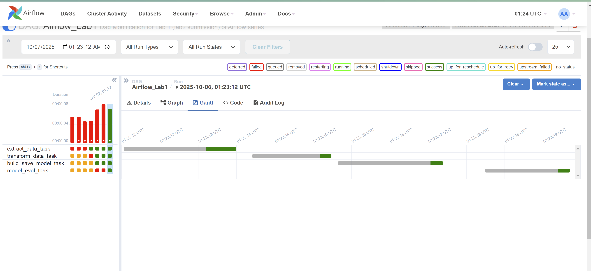
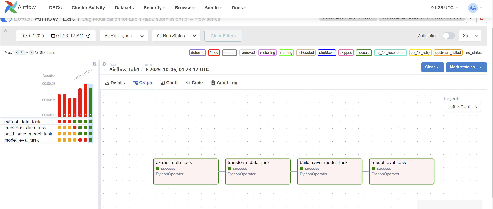

# Lab 2: Airflow Lab 1 Variation

### Variations Made: 
- 1: Performed simple web-scrape to obtain government unemployment data from 2023-2025
- 2: Used Task Instance object to pass file path names with Xcom instead of passing data itself
- 3: Transformed the data to get each month's rate
- 4: Performed simple linear regression
- 5: Evaluated the trained model via MSE and R2 score
- 6: predicted  next month's unemployment rate  
Overall, still 4 DAG steps.

**Difficulties Encountered:**
- Fair amount of time to briefly learn and understand the workflow of Airflow
- Specific difficulty understanding how data is passeed between tasks
- I had errors related to the file creation permission of directories: Airflow does not have simple permission to create file.
- I learned that all return values must be comopatible with JSON format, since JSON data is stored in the Airflow database. 

**Airflow Result Picture 1:**  
  
    
  
  
**Airflow Result Picture 2:**  

